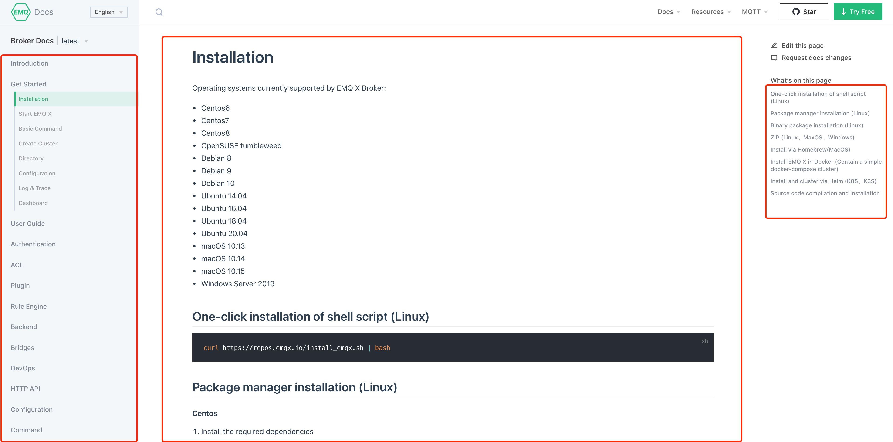

# EMQ Documentation Writing Guide


## Table of Contents

- [Introduction](#introduction)
- [Left menu configuration](#left-menu-configuration)
  - [Configuration files](#configuration-files)
  - [Configuration examples](#configuration-examples)
  - [Notes](#notes)
- [Markdown writing specifications](#markdown-writing-specifications)
  - [Must have a level 1 heading](#must-have-a-level-1-heading)
  - [Headings must obey the hierarchy](#headings-must-obey-the-hierarchy)
  - [Code block](#code-block)
  - [Escape special characters](#escape-special-characters)
  - [Resource reference](#resource-reference)
  - [Special grammars](#special-grammars)
  - [Differentiated compilation](#differentiated-compilation)


## Introduction

EMQ documents are written in Markdown format and use [Vuepress](https://vuepress.vuejs.org/) compiling the Markdown file to HTML file.

The final presentation of the documentation can be divided into three parts:

- Left menu.

  This part needs to be configured mutually by the document writer. The configuration contains three parts: directory name, directory hierarchy, and directory order.

- Intermediate document content.

  This part will display the specific content of the Markdown file.

- In-page index on the right hand.

  This part will automatically display all level 2 headings within the Markdown file. Therefore, a sensible Markdown heading will allow users to quickly understand the outline of document content and jump around the page.




## Left menu configuration

### Configuration files

The menu configuration file is `directory.json` (`directory_ee.json` for Enterprise) in the document root directory. This is shown below:


### Configuration examples

We take the following configuration for `Introduction`  as an example.


The corresponding configuration is:

```json
{
  "en": [
    {
      "title": "Introduction",
      "children": [
        {
          "title": "EMQ X Broker",
          "path": "./"
        },
        {
          "title": "Features List",
          "path": "introduction/checklist"
        }
      ]
    },
    ...
  ]
  "cn": [
    ...
  ]
}
```

Corresponding file structure:

```bash
.
├── en_US
│   ├── README.md
│   └── introduction
│       └── checklist.md
```

The corresponding page routing of the file structure:

| Relative path to the file  | Page routing address         |
| -------------------------- | ---------------------------- |
| /README.md                 | /                            |
| /introduction/checklist.md | /introduction/checklist.html |

### Notes

* The contents of the `path` configuration item must not be duplicated;
* `path` only need to specify the Markdown file, and can not use paths with anchors;
* Nested next-level directories using `children`, supporting multiple levels of nesting; 
* When using `children`, you cannot also specify their `path` (i.e. if a directory has subdirectories, you cannot set  `path` for itself);


## Markdown writing specifications

EMQ documents support standard Markdown specification syntax, but the following conventions need to be adhered to when writing documents.

### Must have a level 1 heading

Each Markdown file must have a globally unique level 1 heading that clearly represents the content of the file.

### Headings must obey the hierarchy

The document will read the level 2 heading as the right-hand navigation, obeying the hierarchical relationship to ensure a clear directory structure.

```markdown
# h1
  ## h2
    ### h3
  ## h2
    ### h3
```

### Code block

- Code blocks in documents are uniformly wrapped in **three backquotes**  ` ``` ` and using **indentation** style blocks is **forbidden**.
- Try to append a valid language alias when using code blocks to show correct syntax highlighting.

### Escape special characters

- If you need the original article to output the `<xxx>` tag and this tag is not in a code block or in-line code, you need to add a backslash `\` before the tag.

  Use `### log set-level \<Level> ` instead of `### log set-level <Level>`;

- If you need the original article to output the double curly braces `{{ xxx }}`, you need to wrap it with v-pre (you don't need to wrap it when inside a code block).

  Input

  ```markdown
  ::: v-pre
  {{ This will be displayed as-is }}
  :::
  ```

  Output

  {{ This will be displayed as-is }}

### Resource reference

- The name of the image must be in English and contain no spaces.

- Relative paths must be used for image references.

  For example, using `` instead of ``

### Special grammars

The documentation supports the following special syntax.

```markdown
::: tip
This is a tip
:::

::: warning
This is a warning
:::

::: danger
This is a dangerous warning
:::
```

The output is as follows.


### Differentiated compilation

Broker and Enterprise share the same document repository and the differentiated compilation can be implemented by using the following syntax.

```markdown
# Broker Docs

  contents


# Enterprise Docs

  contents

```

Correct

```markdown

  contents


or

 contents 
```

Incorrect

```markdown
 contents


or


contents 
```

