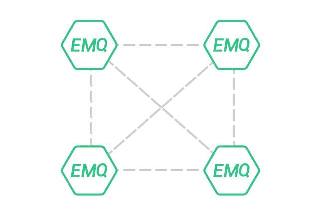
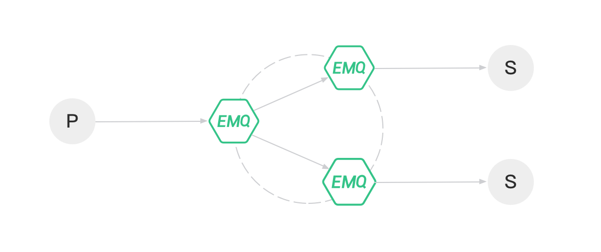
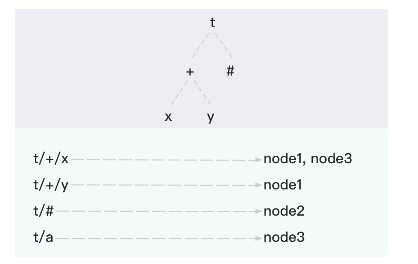

# Cluster

## Distributed Erlang 
Erlang / OTP was originally a programming language platform designed by Ericsson for the development of telecommunication equipment systems. Telecommunication equipment (routers, access gateways) is typically a distributed system that connects the main control board and multiple business boards through the backplane. 

### Nodes and distributed Erlang
The distributed programs of the Erlang / OTP language platform are composed of distributed interconnected Erlang runtime systems. Each Erlang runtime system is called a node. Nodes are interconnected by TCP to form a network structure.

Erlang nodes are identified by a unique node name, which consists of two parts separated by `@`:

```bash
<name>@<ip-address>
```

Communication between nodes is addressed by node name. For example, start four shell terminals locally, and then use the `-name` parameter to start four Erlang nodes respectively:

```bash
erl -name node1@127.0.0.1 -setcookie my_nodes
erl -name node2@127.0.0.1 -setcookie my_nodes
erl -name node3@127.0.0.1 -setcookie my_nodes
erl -name node4@127.0.0.1 -setcookie my_nodes
```

 `node ().` can be used to view the name of this node, and `nodes ().` can be used to view other nodes that have established a connection with the current node. We now go to the console of 'node1@127.0.0.1' and check the current node name and connected nodes:

```bash
(node1@127.0.0.1) 4> node().
'node1@127.0.0.1'

(node1@127.0.0.1) 4> nodes().
[]
```

Then we let node1 initiate connections with other nodes:

```bash
(node1@127.0.0.1) 1> net_kernel:connect_node('node2@127.0.0.1').
true
(node1@127.0.0.1) 2> net_kernel:connect_node('node3@127.0.0.1').
true
(node1@127.0.0.1) 3> net_kernel:connect_node('node4@127.0.0.1').
true
```

Now we can check other nodes that are already connected to node1:

```bash
(node1@127.0.0.1) 4> nodes().
['node2@127.0.0.1','node3@127.0.0.1','node4@127.0.0.1']
```

We can see that node2, node3, and node4 have established a distributed connection with node1, and these four nodes form a cluster. Note that whenever a new node joins the cluster, it will establish a TCP connection with all the nodes in the cluster. At this point, the four nodes have completed the mesh structure shown in the following figure:



### Security
Cookies are used for interconnection authentication between Erlang nodes. A cookie is a string, and only two nodes with the same cookie can establish a connection. In the [Previous section](#node-and-distributed-erlang), We used the `-setcookie my_nodes` parameter to set the same cookie of ` my_nodes` to four nodes.

See <http://erlang.org/doc/reference_manual/distributed.html> for details.

### EMQ X Broker Cluster protocol settings
Each node in the Erlang cluster can be connected through TCPv4, TCPv6 or TLS, and the connection method can be configured in`etc/emqx.conf`:

| Configuration name | Type | Default value | Description |
| ----- | --- | ----- | ---- |
| cluster.proto_dist | enum | `inet_tcp` | Distributed protocol with optional values are as follows:<br />  - inet_tcp: use TCP IPv4<br/>  - inet6_tcp: use TCP IPv6<br/>  - inet_tls: use TLS |
| node.ssl_dist_optfile | file path | `etc/ssl_dist.conf` | When `cluster.proto_dist` is selected as inet_tls, you need to configure the ` etc/ssl_dist.conf` file, and specify the TLS certificate. |

## EMQ X Broker Distributed cluster design
The basic function of EMQ X Broker distribution is to forward and publish messages to subscribers on each node, as shown in the following figure:



To achieve this, EMQ X Broker maintains several data structures related to it: subscription tables, routing tables, and topic trees.

### Subscription Table: Topics-Subscribers
When an MQTT client subscribes to a topic, EMQ X Broker maintains a **Subscription Table** for the Topic-\> Subscriber mapping. The subscription table only exists on the EMQ X Broker node where the subscriber is located, for example:

```bash
node1:

    topic1 -> client1, client2
    topic2 -> client3

node2:

    topic1 -> client4
```

### Route Table: Topic-Node
All nodes in the same cluster will **copy** a topic-to-> node mapping table, for example:

```bash
topic1 -> node1, node2
topic2 -> node3
topic3 -> node2, node4
```

### Topic tree: topic matching with wildcards
In addition to the routing table, each node in the EMQ X Broker cluster also maintains a backup of the **Topic Trie.**

The following topic-subscription relationship is an example:

| Client | Node | Subscribed topic |
| ----- | --- | ------- |
| client1 | node1 | t/+/x, t/+/y |
| client2 | node2 | t/# |
| client3 | node3 | t/+/x, t/a |

When all subscriptions are completed, EMQ X Broker maintains the following Topic Trie and Route Table:



### Message Distribution Process
When an MQTT client publishes a message, the node where it is located retrieves the route table and forwards the message to the relevant node according to the message topic, and then the relevant node retrieves the local subscription table and sends the message to the relevant subscriber.

For example, when client1 publishes a message to the topic `t/a`. The routing and distribution of the message between nodes are as follows:

1. client1 publishes a message with the topic `t/a` to the node1
2. By querying the topic tree, node1 learns that `t/a` can match the two existing topics of ` t/a` and `t/#`.
3. By querying the route table, node1 learns that topic `t/a` has subscribers only on node3, and topic` t/# `has subscribers only on node2. So node1 forwards the message to node2 and node3.
4. After node2 receives the forwarded  `t/a` message, it queries the local subscription table to obtain the subscribers who have subscribed to ` t/# ` on this node and distributes the message to them.
5. After node3 receives the forwarded  `t/a` message, it queries the local subscription table to obtain the subscribers who have subscribed to ` t/a ` on this node and distributes the message to them.
6. Message forwarding and distribution are finished.

### Data partition and sharing
EMQ X Broker's subscription table is partitioned in the cluster, while the topic tree and routing table are replicated.

## Node discovery and automatic clustering
EMQ X Broker supports Autocluster based on Ekka library. Ekka is a cluster management library developed for Erlang / OTP applications. It supports Service Discovery, Autocluster, Network Partition Autoheal, and Autoclean of  Erlang node.

EMQ X supports multiple node discovery strategies:

| strategy | Description                       |
| -------- | --------------------------------- |
| manual   | Creating a cluster manually       |
| static   | Autocluster of static node lists  |
| mcast    | Autocluster of UDP multicast mode |
| dns      | Autocluster DNS A record          |
| etcd     | Autocluster by etcd               |
| k8s      | Autocluster of Kubernetes service |

### Creating a cluster manually
The default configuration is to manually create a cluster. Nodes should be added via the command of ./bin/emqx\_ctl join \ <Node \>:

```bash
cluster.discovery = manual
```

### Autocluster based on static node list
Configure a fixed node list to automatically discover and create clusters:

```bash
cluster.discovery = static
cluster.static.seeds = emqx1@127.0.0.1,emqx2@127.0.0.1
```

### Autocluster based on mcast  
Automatically discover and create clusters based on UDP multicast:

```bash
cluster.discovery = mcast
cluster.mcast.addr = 239.192.0.1
cluster.mcast.ports = 4369,4370
cluster.mcast.iface = 0.0.0.0
cluster.mcast.ttl = 255
cluster.mcast.loop = on
```

### Autocluster based on DNS A records 
Automatically discover and create clusters based on DNS A records:

```bash
cluster.discovery = dns
cluster.dns.name = localhost
cluster.dns.app  = ekka
```

### Autocluster based on etcd 
Automatically discover and create clusters based on [etcd](https://coreos.com/etcd/):

```bash
cluster.discovery = etcd
cluster.etcd.server = http://127.0.0.1:2379
cluster.etcd.prefix = emqcl
cluster.etcd.node_ttl = 1m
```

### Autocluster based on kubernetes 
Automatically discover and create clusters based on [Kubernetes](https://kubernetes.io/):

```bash
cluster.discovery = k8s
cluster.k8s.apiserver = http://10.110.111.204:8080
cluster.k8s.service_name = ekka
cluster.k8s.address_type = ip
cluster.k8s.app_name = ekka
```

### Introduction to manual cluster management
Deploy EMQ X Broker cluster on two servers of s1.emqx.io, s2.emqx.io:

|                Node name                | Server |   IP address   |
| ------------------------------------ | ------------- | ------------ |
| emqx@s1.emqx.io or emqx@192.168.0.10 | s1.emqx.io    | 192.168.0.10 |
| emqx@s2.emqx.io or emqx@192.168.0.20 | s2.emqx.io    | 192.168.0.20 |

::: tip Tip
The format of node name is<Name@Host>, and Host must be an IP address or FQDN (server name. Domain name)
:::

#### Configure emqx@s1.emqx.io node

emqx/etc/emqx.conf:

```bash
node.name = emqx@s1.emqx.io
# or
node.name = emqx@192.168.0.10
```

Configure through environment variables:

```bash
export EMQX_NODE_NAME=emqx@s1.emqx.io && ./bin/emqx start
```

::: tip Tip
After a node starts to join the cluster, the node name cannot be changed.
:::

#### Configure emqx@s2.emqx.io node

emqx/etc/emqx.conf:

```bash
node.name = emqx@s2.emqx.io
# or
node.name = emqx@192.168.0.20
```

#### Node joins the cluster

After starting two nodes, the join can be executed on s2.emqx.io:

```bash
$ ./bin/emqx_ctl cluster join emqx@s1.emqx.io

Join the cluster successfully.
Cluster status: [{running_nodes,['emqx@s1.emqx.io','emqx@s2.emqx.io']}]
```

Or executed on s1.emqx.io:

```bash
$ ./bin/emqx_ctl cluster join emqx@s2.emqx.io

Join the cluster successfully.
Cluster status: [{running_nodes,['emqx@s1.emqx.io','emqx@s2.emqx.io']}]
```

Query the cluster status on any node:

```bash
$ ./bin/emqx_ctl cluster status

Cluster status: [{running_nodes,['emqx@s1.emqx.io','emqx@s2.emqx.io']}]
```

#### Exit the cluster

There are two ways for a node to exit the cluster:

1. leave: Leave this node exit the cluster
2. force-leave: Remove other nodes from cluster

Let emqx@s2.emqx.io actively exit the cluster:

```bash
$ ./bin/emqx_ctl cluster leave
```

Or remove the emqx@s2.emqx.io node from the cluster on s1.emqx.io:

```bash
$ ./bin/emqx_ctl cluster force-leave emqx@s2.emqx.io
```

## Network Partition Autoheal 
*EMQ X* supports Network Partition Autoheal, which can be configure in `etc/emqx.conf`:

```bash
cluster.autoheal = on
```

Network Partition Autoheal Process:

1. The node performs Network Partition confirmation 3 seconds after receiving the `inconsistent_database` event from Mnesia;
2. After the node confirms that the Network Partition has occurred, it reports the message to the Leader node (the earliest start node in the cluster);
3. After the Leader node delays for a period of time, it create a SplitView when all nodes are online;
4. The Leader node selects the self-healing Coordinator node in the majority partition;
5. The Coordinator node restarts the minority partition node to restore the cluster.

## Autoclean of Cluster nodes 
*EMQ X* supports Autoclean frol cluster , which can be configured in `etc/emqx.conf` :

```bash
cluster.autoclean = 5m
```

## Firewall settings
If there is a firewall between the cluster nodes, the firewall needs to open port 4369 and a TCP port segment. 4369 is used by the epmd port mapping service. The TCP port segment is used to establish connections and communications between nodes.

After the firewall is set, you need to configure the same port segment in  `emqx/etc/emqx.conf`:

```bash
## Distributed node port range
node.dist_listen_min = 6369
node.dist_listen_max = 7369
```
