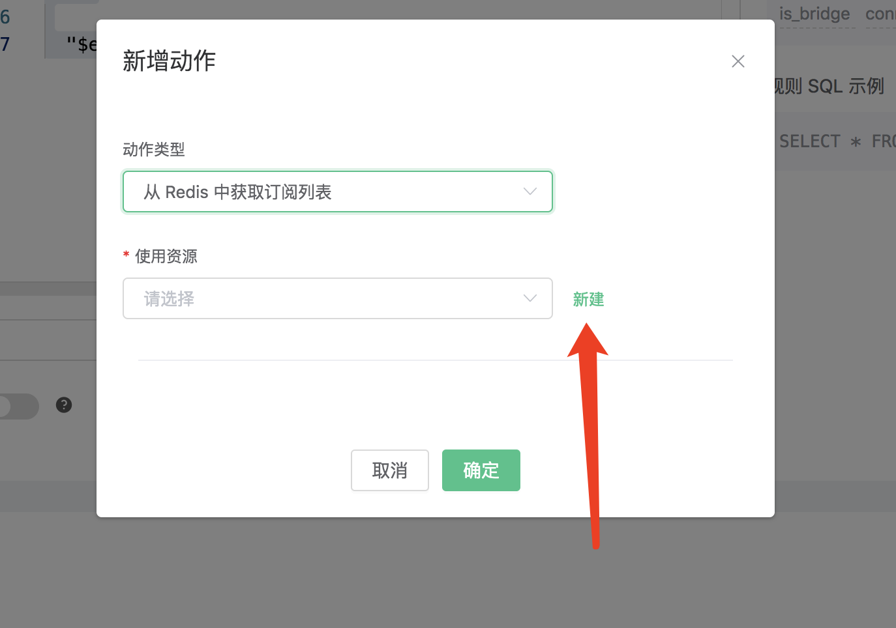
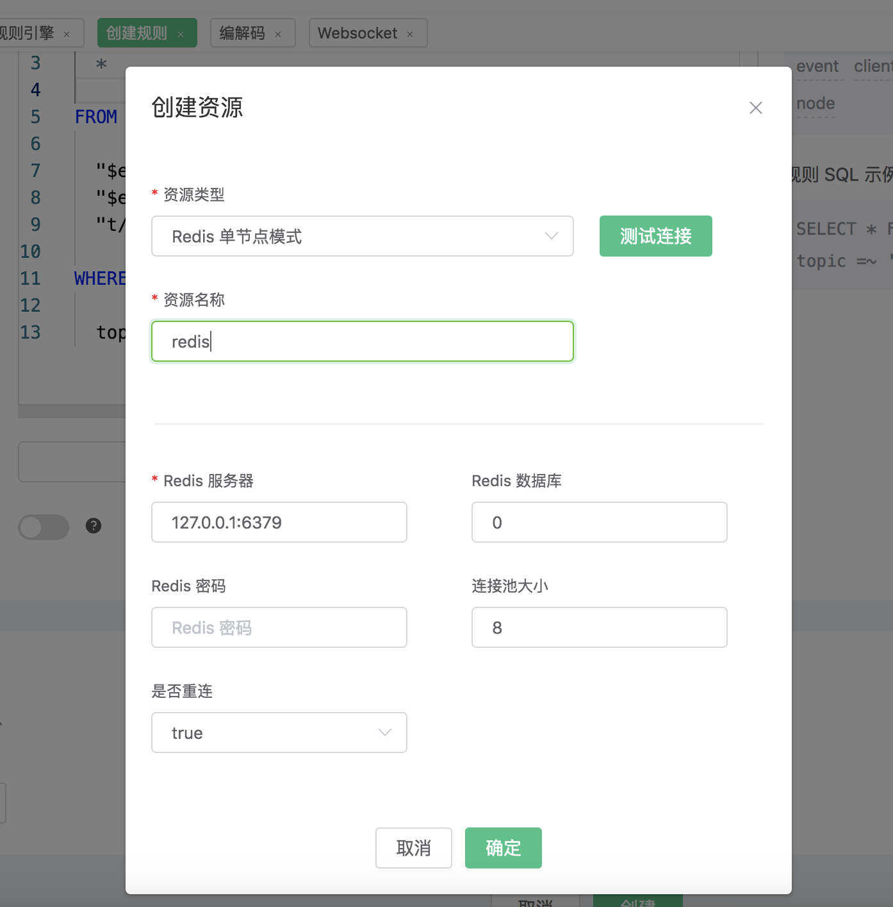
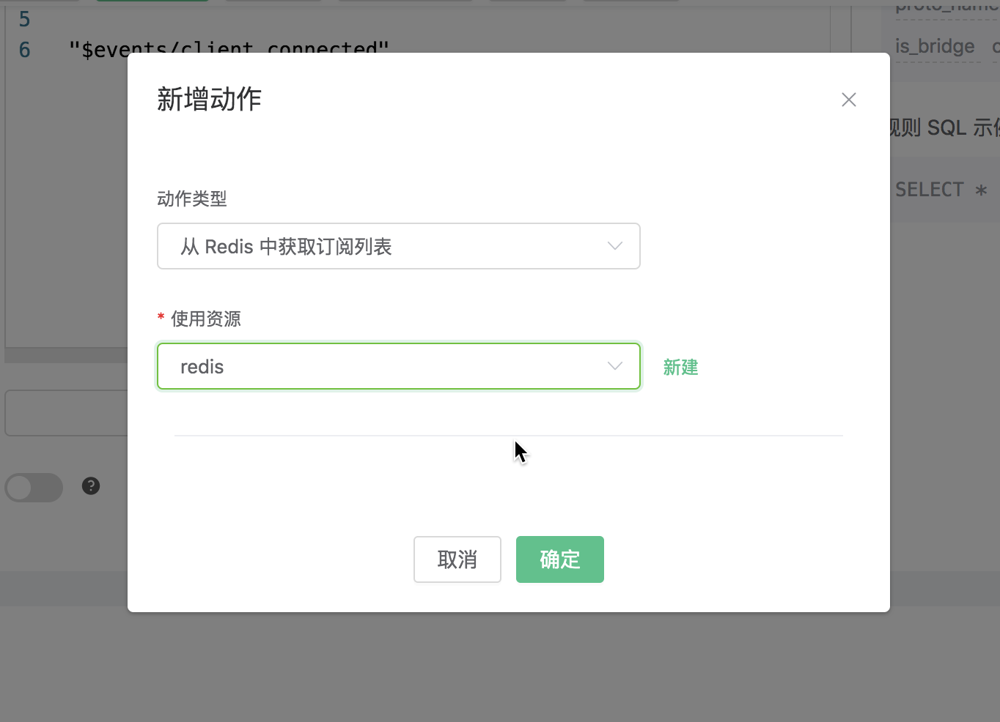

# Get subscription relationship from  Redis

Set up the Redis environment, and take MacOS X as an example:

```bash
 $ wget http://download.redis.io/releases/redis-4.0.14.tar.gz
$ tar xzf redis-4.0.14.tar.gz
$ cd redis-4.0.14
$ make && make install

# Start redis
$ redis-server
```

Create rules:

Open [EMQ X Dashboard](http://127.0.0.1:18083/#/rules) and select the "Rules" tab on the left.

Then fill in the rule SQL:

```bash
SELECT * FROM "$events/client_connected"
```


Related actions:

Select "Add Action" on the "Response Action" interface, and then select "Get Subscription List from Redis" in the "Add Action" drop-down box.


Fill in the action parameters:

The action of "Get subscription list from Redis" requires one parameter:

1). Associated resources. The resource drop-down box is empty now, and you can click "New" in the upper right corner to create a Redis resource:



Select "Redis single-node mode resources".



Fill in the resource configuration:

Fill in the real Redis server address and keep other configurations at default values. Then, click the "Test Connection" button to ensure that the connection test is successful.

Finally click the "Create" button.



Return to the response action interface and click "OK".


Return to the rule creation interface and click "Create".


The rule has been created, and you can insert a subscription relationship into Redis through  Redis CLI:

```bash
HSET mqtt:sub:test t1 1
```


Log in to the device whose clientid is test via Dashboard:


Check the subscription list, and you can see that the **test** device has subscribed to the **t1** topic:


