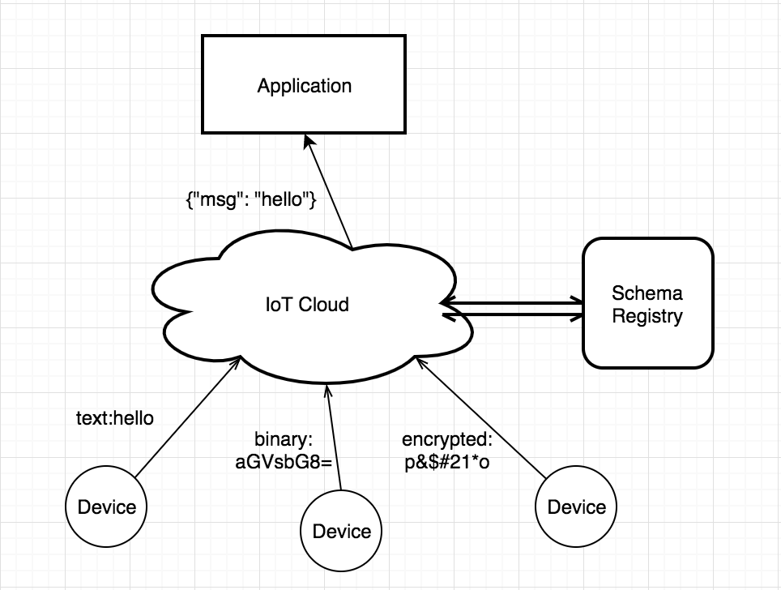
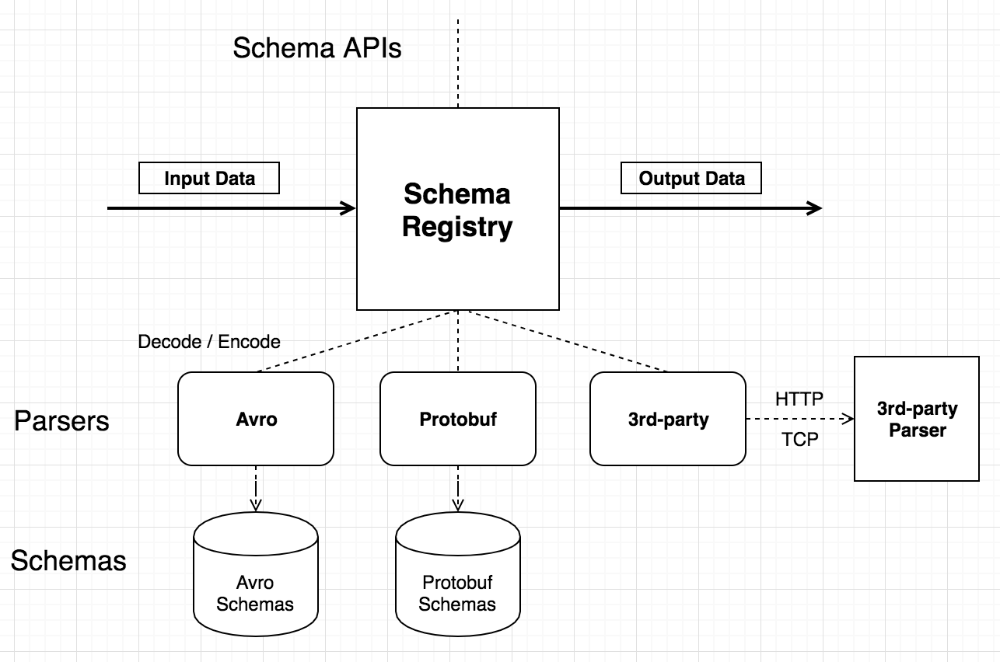
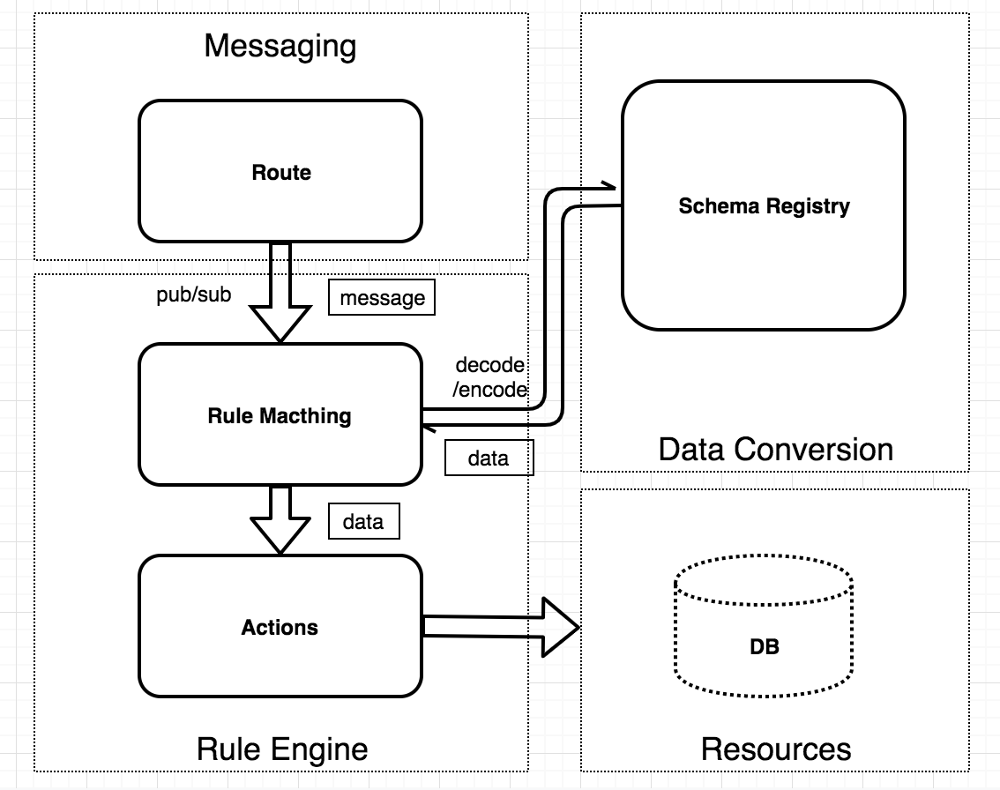

# Introduction to Schema Registry


Because of the variety of IoT device terminals and the different coding formats used by various manufacturers, the need for a unified data format arises when accessing the IoT platform for device management by the applications on the platform.

The Schema Registry manages the Schema used for coding and decoding, processes the encoding or decoding requests, and returns the results. The Schema Registry in collaboration with the rule engine can be adapted for device access and rule design in various scenarios.

EMQ X Schema Registry currently supports codecs in three formats: [Avro](https://avro.apache.org), [Protobuf](https://developers.google.com/protocol-buffers/), and custom encoding. Avro and Protobuf are Schema-dependent data formats. The encoded data is binary and the decoded data is in Map format. The decoded data can be used directly by the rule engine and other plugins. User-defined (3rd-party) coding and decoding services can perform coding and decoding more closely to business needs via HTTP or TCP callbacks.

::: tip
Schema Registry maintains Schema text for built-in encoding formats such as Avro and Protobuf, but for custom codec (3rd-party) formats, Schema text needs to be maintained by the codec service itself, if required.
:::


## Data Format

The diagram below shows an example of a Schema Registry application. Multiple devices report data in different formats, which are decoded by Schema Registry into a uniform internal format and then forwarded to the backend application.




### Binary format support

Schema Registry data formats include [Avro](https://avro.apache.org) and [Protobuf](https://developers.google.com/protocol-buffers/). Avro and Protobuf are Schema-dependent data formats and encoded as binary data. The internal data format (Map, explained later) decoded using the Schema Registry can be used directly by rule engines and other plugins. Besides, Schema Registry supports user-defined (3rd-party) coding and decoding services that can perform coding and decoding more closely to business needs via HTTP or TCP callbacks.

## Architecture Design

Schema Registry maintains Schema text for built-in encoding formats such as Avro and Protobuf, but for custom codec (3rd-party) formats, Schema text needs to be maintained by the codec service itself, if required. The Schema API provides for add, query, and delete operations via Schema Name.

The Schema Registry can perform both decoding and encoding.  Schema Name needs to be specified when encoding and decoding.




Example of an encoding call: parameter is Schema:

```c
schema_encode(SchemaName, Data) -> RawData
```

Example of a decoding call:

```c
schema_decode(SchemaName, RawData) -> Data
```

A common use case is to use the rule engine to call the encoding and decoding interfaces provided by the Schema Registry and then use the encoded or decoded data as input for subsequent actions.


## Codec + Rules Engine

The message processing level of EMQ X can be divided into three parts: Messaging, Rule Engine, and Data Conversion.

EMQ X's PUB/SUB system routes messages to specified topics. The rule engine has the flexibility to configure business rules for the data, match messages to the rules and then specify the corresponding action. Data format conversion occurs before the rule matching process, converting the data into a Map format that can participate in rule matching, and then matching it.




### Rule engine internal data format (Map)

The data format used in the internal rule engine is Erlang Map, so if the original data is in binary or other formats, it must be converted to Map using codec functions (such as schema_decode and json_decode as mentioned above).

A Map is a data structure of the form Key-Value, in the form #{key => value}. For example, `user = #{id => 1, name => "Steve"} ` defines a `user` Map with `id` of `1` and `name` of `"Steve"`.

The SQL statement provides the "." operator to extract and add Map fields in a nested way. The following is an example of this Map operation using a SQL statement:

```sql
SELECT user.id AS my_id
```

The filter result of the SQL statement is `#{my_id => 1}`.

### JSON Codec

The SQL statements of the rules engine provide support for coding and decoding JSON formatted strings. The SQL functions for converting JSON strings to Map format are json_decode() and json_encode():

```sql
SELECT json_decode(payload) AS p FROM "t/#" WHERE p.x = p.y
```

The SQL statement above will match an MQTT message with the content of the payload as a JSON string: `{"x" = 1, "y" = 1}`, and the topic as `t/a`.

`json_decode(payload) as p` decodes the JSON string into the following Map data structure so that the fields in the Map can be used in the `WHERE` clause using p.x and p.y.

```erlang
#{
  p => #{
    x => 1,
    y => 1
  }
}
```

**Note:** The `AS` clause is required to assign the decoded data to a Key so that subsequent operations can be performed on it later.

## Coding and Decoding in Practice

### Protobuf data parsing example

#### Rule requirements

The device publishes a binary message encoded using Protobuf, which needs to be matched by the rule engine and then republished to the topic associated with the "name" field. The format of the topic is "person/${name}".

For example, republish a message with the "name" field as "Shawn" to the topic "person/Shawn".

#### Create schema

In the [Dashboard](http://127.0.0.1:18083/#/schemas/0?oper=create) interface of EMQ X, create a Protobuf Schema using the following parameters:

1. Name: protobuf_person

2. Codec Type: protobuf

3. Schema: The following protobuf schema defines a Person message.

```protobuf
message Person {
  required string name = 1;
  required int32 id = 2;
  optional string email = 3;
}
```

#### Creating rules

**Use the Schema you have just created to write the rule SQL statement:**

```sql
SELECT
  schema_decode('protobuf_person', payload, 'Person') as person, payload
FROM
  "t/#"
WHERE
  person.name = 'Shawn'
```

The key point here is `schema_decode('protobuf_person', payload, 'Person')`:

- The `schema_decode` function decodes the contents of the payload field according to the Schema 'protobuf_person';
- `as person` stores the decoded value in the variable "person";
- The last argument `Person` specifies that the message type in the payload is the 'Person' type defined in the protobuf schema.

**Then add the action using the following parameters:**

- Action Type: Message republishing
- Destination Topic: person/${person.name}
- Message Content Template: ${person}

This action sends the decoded "person" to the topic `person/${person.name}` in JSON format. `${person.name}` is a variable placeholder that will be replaced at runtime with the value of the "name" field in the message content.

#### Device side code

Once the rules have been created, it is time to simulate the data for testing.

The following code uses the Python language to fill a Person message and encode it as binary data, then sends it to the "t/1" topic. See [full code](https://github.com/terry-xiaoyu/schema-registry-examples/blob/master/protobuf/pb2_mqtt.py) for details.

```python
def publish_msg(client):
    p = person_pb2.Person()
    p.id = 1
    p.name = "Shawn"
    p.email = "liuxy@emqx.io"
    message = p.SerializeToString()
    topic = "t/1"
    print("publish to topic: t/1, payload:", message)
    client.publish(topic, payload=message, qos=0, retain=False)
```

#### Checking rule execution results

1)  In the Dashboard's [Websocket](http://127.0.0.1:18083/#/websocket) tools, log in to an MQTT Client and subscribe to "person/#".

2)  Install the python dependency and execute the device-side code:

```shell
$ pip3 install protobuf
$ pip3 install paho-mqtt

$ python3 ./pb2_mqtt.py
Connected with result code 0
publish to topic: t/1, payload: b'\n\x05Shawn\x10\x01\x1a\rliuxy@emqx.io'
t/1 b'\n\x05Shawn\x10\x01\x1a\rliuxy@emqx.io'
```

3) Check that a message with the topic `person/Shawn` is received on the Websocket side:

```bash
{"email":"liuxy@emqx.io","id":1,"name":"Shawn"}
```


### Avro data parsing example

#### Rule requirements

The device publishes a binary message encoded using Avro, which needs to be matched by the rule engine and then republished to the topic associated with the "name" field. The format of the topic is "avro_user/${name}".

For example, republish a message with the "name" field as "Shawn" to the topic "avro_user/Shawn".

#### Create Schema

In the [Dashboard](http://127.0.0.1:18083/#/schemas/0?oper=create) interface of EMQ X, create an Avro Schema using the following parameters:

1. Name: avro_user

2. Codec Type: avro

3. Schema:

```protobuf
{
"type":"record",
"fields":[
    {"name":"name", "type":"string"},
    {"name":"favorite_number", "type":["int", "null"]},
    {"name":"favorite_color", "type":["string", "null"]}
]
}
```

#### Creating rules

**Use the Schema you have just created to write the rule SQL statement:**

```sql
SELECT
  schema_decode('avro_user', payload) as avro_user, payload
FROM
  "t/#"
WHERE
  avro_user.name = 'Shawn'
```

The key point here is `schema_decode('avro_user', payload)`:

- The `schema_decode` function decodes the contents of the payload field according to the Schema "avro_user";
- `as avro_user` stores the decoded value in the variable "avro_user";

**Then add the action using the following parameters:**

- Action Type: Message republishing
- Destination Topic: avro_user/${avro_user.name}
- Message Content Template: ${avro_user}

This action sends the decoded "user" to the topic `avro_user/${avro_user.name}` in JSON format. `${avro_user.name}` is a variable placeholder that will be replaced at runtime with the value of the "name" field in the message content.

#### Device side code

Once the rules have been created, it is time to simulate the data for testing.

The following code uses the Python language to fill a User message and encode it as binary data, then sends it to the "t/1" topic. See [full code](https://github.com/terry-xiaoyu/schema-registry-examples/blob/master/avro/avro_mqtt.py) for details.

```python
def publish_msg(client):
    datum_w = avro.io.DatumWriter(SCHEMA)
    buf = io.BytesIO()
    encoder = avro.io.BinaryEncoder(buf)
    datum_w.write({"name": "Shawn", "favorite_number": 666, "favorite_color": "red"}, encoder)
    message = buf.getvalue()
    topic = "t/1"
    print("publish to topic: t/1, payload:", message)
    client.publish(topic, payload=message, qos=0, retain=False)
```

#### Checking rule execution results

1)  In the Dashboard's [Websocket](http://127.0.0.1:18083/#/websocket) tools, log in to an MQTT Client and subscribe to "avro_user/#".

2)  Install the python dependency and execute the device-side code:

```shell
$ pip3 install protobuf
$ pip3 install paho-mqtt

$ python3 avro_mqtt.py
Connected with result code 0
publish to topic: t/1, payload: b'\nShawn\x00\xb4\n\x00\x06red'
```

3) Check that a message with the topic `avro_user/Shawn` is received on the Websocket side:

```
{"favorite_color":"red","favorite_number":666,"name":"Shawn"}
```

### Custom codec example

#### Rule requirements

The device publishes an arbitrary message to verify that the self-deployed codec service is working normally.

#### Create Schema

In the [Dashboard](http://127.0.0.1:18083/#/schemas/0?oper=create) interface of EMQ X, create a 3rd-Party Schema using the following parameters:

1. Name: my_parser
2. Codec Type: 3rd-party
3. Third Party Type: HTTP
4. URL: http://127.0.0.1:9003/parser
5. Codec Configuration: xor

All other configurations remain default.

Item 5 (i.e.codec configuration) above is optional and is a string, the content of which is related to the service of the codec service.

#### Creating rules

**Use the Schema you have just created to write the rule SQL statement:**

```sql
SELECT
  schema_encode('my_parser', payload) as encoded_data,
  schema_decode('my_parser', encoded_data) as decoded_data
FROM
  "t/#"
```

This SQL statement first encodes and then decodes the data to verify that the encoding and decoding process is correct:

- The `schema_encode` function encodes the contents of the payload field according to the Schema 'my_parser' and stores the result in the variable `encoded_data`;
- The `schema_decode` function decodes the contents of the payload field according to the Schema 'my_parser' and stores the result in the variable `decoded_data`;

The final filtered result of this SQL statement is the variables `encoded_data` and `decoded_data`.

**Then add the action using the following parameters:**

- Action Type: Check (debug)

This check action prints the results filtered by the SQL statement to the emqx console (erlang shell).

If the service is started with emqx console, the print will be displayed directly in the console; if the service is started with emqx start, the print will be output to the erlang.log.N file in the log directory, where "N" is an integer, e.g. "erlang.log.1", " erlang.log.2".

#### Codec server-side code

Once the rules have been created, it is time to simulate the data for testing. Therefore, the first thing you need to do is write your own codec service.

The following code implements an HTTP codec service using the Python language. For simplicity, this service provides two simple ways of coding and decoding (encryption and decryption). See [full code](https://github.com/terry-xiaoyu/schema-registry-examples/blob/master/3rd_party/http_parser_server.py) for details.

- xor
- Character substitution

```python
def xor(data):
  """
  >>> xor(xor(b'abc'))
  b'abc'
  >>> xor(xor(b'!}~*'))
  b'!}~*'
  """
  length = len(data)
  bdata = bytearray(data)
  bsecret = bytearray(secret * length)
  result = bytearray(length)
  for i in range(length):
    result[i] = bdata[i] ^ bsecret[i]
  return bytes(result)

def subst(dtype, data, n):
  """
  >>> subst('decode', b'abc', 3)
  b'def'
  >>> subst('decode', b'ab~', 1)
  b'bc!'
  >>> subst('encode', b'def', 3)
  b'abc'
  >>> subst('encode', b'bc!', 1)
  b'ab~'
  """
  adata = array.array('B', data)
  for i in range(len(adata)):
    if dtype == 'decode':
      adata[i] = shift(adata[i], n)
    elif dtype == 'encode':
      adata[i] = shift(adata[i], -n)
  return bytes(adata)
```

Run this service:

```shell
$ pip3 install flask
$ python3 http_parser_server.py
 * Serving Flask app "http_parser_server" (lazy loading)
 * Environment: production
   WARNING: This is a development server. Do not use it in a production deployment.
   Use a production WSGI server instead.
 * Debug mode: off
 * Running on http://127.0.0.1:9003/ (Press CTRL+C to quit)
```

#### Checking rule execution results

Since this example is relatively simple, we'll use the MQTT Websocket client directly to simulate sending a message on the device side.

1) In the Dashboard's [Websocket](http://127.0.0.1:18083/#/websocket) tools, log in to an MQTT Client and publish a message to "t/1" with the text "hello".

2) Check what is printed in the emqx console (erlang shell):

```bash
(emqx@127.0.0.1)1> [inspect]
        Selected Data: #{decoded_data => <<"hello">>,
                         encoded_data => <<9,4,13,13,14>>}
        Envs: #{event => 'message.publish',
                flags => #{dup => false,retain => false},
                from => <<"mqttjs_76e5a35b">>,
                headers =>
                    #{allow_publish => true,
                      peername => {{127,0,0,1},54753},
                      username => <<>>},
                id => <<0,5,146,30,146,38,123,81,244,66,0,0,62,117,0,1>>,
                node => 'emqx@127.0.0.1',payload => <<"hello">>,qos => 0,
                timestamp => {1568,34882,222929},
                topic => <<"t/1">>}
        Action Init Params: #{}
```

Select Data is the data filtered by the SQL statement, Envs are available environment variables within the rule engine and Action Init Params is the initialization parameters for actions. All three data are in `Map` format.

The two fields `decoded_data` and `encoded_data` in Selected Data correspond to the two ASs in the SELECT statement. Because `decoded_data` is the result of encoding and then decoding, it is reverted to the content we sent, "hello", indicating that the codec plugin is working correctly.
