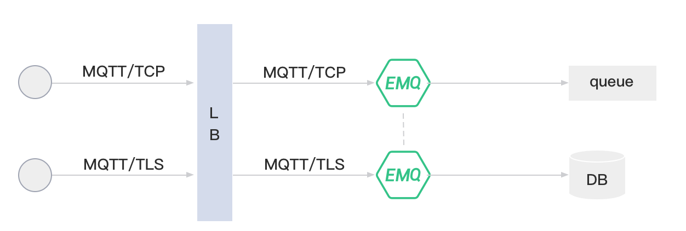
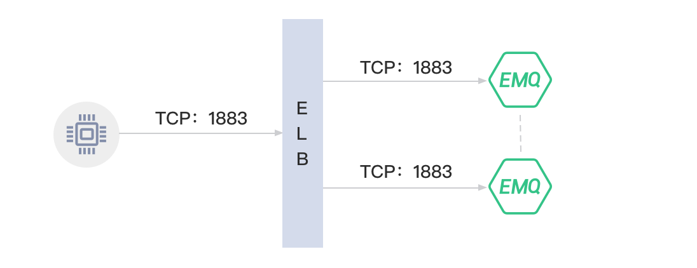

# Production deployment

During development, we usually use compressed packages to start services with the form of a single node. However, production operation requires a simpler and more stable way. This page mainly explains how to deploy your EMQ X service from best practices of deployment architecture.


## Deployment architecture

EMQ X cluster can be deployed as an IoT access service (IoT Hub). Currently, EMQ provides free software images out of the box on cloud service providers such as QingCloud, Aliyun, and AWS. For special hardware platforms and system versions such as Raspberry Pi and Linux ARM, source code compilation and installation can be used.

Typical deployment architecture:




## Load Balancer (LB)

The Load Balancer (LB) distributes MQTT connections and traffic from devices across the *EMQ X* clusters. LB enhances the HA of the clusters, balances the loads among the cluster nodes and makes the dynamic expansion possible.

It is recommended that SSL connections are terminated by a LB. The links between devices and the LB are secured by SSL, while the links between the LB and *EMQ X* cluster nodes are plain TCP connections. By this setup, a single *EMQ X* cluster can serve a million devices.

LB products of public cloud providers:

| Cloud provider                                               | SSL Termination | LB Product DOC/URL                                   |
| ------------------------------------------------------------ | --------------- | ---------------------------------------------------- |
| [QingCloud](https://qingcloud.com) | Yes             | <https://docs.qingcloud.com/guide/loadbalancer.html> |
| [AWS](https://aws.amazon.com)                                | Yes             | <https://aws.amazon.com/cn/elasticloadbalancing/>    |
| [Aliyun](https://www.aliyun.com)                             | No              | <https://www.aliyun.com/product/slb>                 |
| [UCloud](https://ucloud.cn)                                  | Unknown            | <https://ucloud.cn/site/product/ulb.html>            |
| [QCloud](https://www.qcloud.com)                             | Unknown         | <https://www.qcloud.com/product/clb>                 |

 LBs for Private Cloud: 

| Open-Source LB                     | SSL Termination | DOC/URL                                                 |
| ---------------------------------- | --------------- | ------------------------------------------------------- |
| [HAProxy](https://www.haproxy.org) | Yes             | <https://www.haproxy.com/solutions/load-balancing.html> |
| [NGINX](https://www.nginx.com)     | Yes             | <https://www.nginx.com/solutions/load-balancing/>       |


::: tip

Qingcloud(EMQ X partner) is recommended for domestic public cloud deployments, AWS is recommended for foreign deployments, and HAProxy is recommended for LB for private deployments.

:::


### EMQ X Cluster

*EMQ X* cluster nodes are deployed behind LB. It is suggested that the nodes are deployed on VPCs or on a private network. Cloud provider, such as AWS, Azure or QingCloud, usually provides VPC network.

*EMQ X* Provides the MQTT service on following TCP ports by default:

| Port | Description |
| ----- | --------------------- |
| 1883  | MQTT             |
| 8883  | MQTT/SSL           |
| 8083  | MQTT/WebSocket     |
| 8084  | MQTT/WebSocket/SSL |
| 8081 | Management API |
| 18083 | Dashboard          |

Firewall should make the relevant ports accessible for public according to the MQTT access method. 


TCP ports used by EMQ X node cluster:

| Port | Description         |
| ---- | --------- |
| 4369 | Node discovery port |
| 5369 | Cluster PRC |
| 6369 | Cluster channel |

If deployed between nodes, firewalls should be configured that the above ports are inter-accessible between the nodes. 


## Deploying on QingCloud

1. Create VPC network.
2. Create a ‘private network’ for *EMQ X* cluster inside the VPC network, e.g. 192.168.0.0/24
3. Create 2 *EMQ X* hosts inside the private network, like:

| Node  | IP address  |
| ----- | ----------- |
| emqx1 | 192.168.0.2 |
| emqx2 | 192.168.0.3 |


4. Install and cluster *EMQ X* on these two hosts. Please refer to the sections of cluster installation for details.
5. Create LB and assign the public IP address.
6. Create MQTT TCP listener:


 Or create SSL listener and terminate the SSL connections on LB: 


7. Connect the MQTT clients to the LB using the public IP address and test the deployment.


## Deploying on AWS

1. Create VPC network.
2. Create a ‘private network’ for *EMQ X* cluster inside the VPC network, e.g. 192.168.0.0/24
3. Create 2 hosts inside the private network, like:

| Node  | IP address  |
| ----- | ----------- |
| emqx1 | 192.168.0.2 |
| emqx2 | 192.168.0.3 |


4. Open the TCP ports for MQTT services (e.g. 1883,8883) on the security group.
5. Install and cluster *EMQ X* on these two hosts. Please refer to the sections of cluster installation for details.
6. Create ELB (Classic Load Balancer), assign the VPC network, and assign the public IP address.
7. Create MQTT TCP listener on the ELB:



 Or create SSL listener and terminate the SSL connections on the ELB: 


8. Connect the MQTT clients to the ELB using the public IP address and test the deployment.


## Deploying on private network

### Direct connection of EMQ X cluster

 *EMQ X* cluster should be DNS-resolvable and the clients access the cluster via domain name or IP list: 

1. Deploy *EMQ X* cluster. Please refer to the sections of ‘Installation’ and ‘*EMQ X* nodes clustering’ for details.
2. Enable the access to the MQTT ports on the firewall (e.g. 1883, 8883).
3. Client devices access the *EMQ X* cluster via domain name or IP list.

::: tip
 This kind of deployment is NOT recommended. 
:::

### HAProxy LB

 HAProxy serves as a LB for *EMQ X* cluster and terminates the SSL connections: 

1. Create *EMQ X* Cluster nodes like following:

| node  | IP          |
| ----- | ----------- |
| emqx1 | 192.168.0.2 |
| emqx2 | 192.168.0.3 |

2. Configure /etc/haproxy/haproxy.cfg: 

```yaml
listen mqtt-ssl
  bind *:8883 ssl crt /etc/ssl/emqx/emq.pem no-sslv3
  mode tcp
  maxconn 50000
  timeout client 600s
  default_backend emqx_cluster
        
backend emqx_cluster
  mode tcp
  balance source
  timeout server 50s
  timeout check 5000
  server emqx1 192.168.0.2:1883 check inter 10000 fall 2 rise 5 weight 1
  server emqx2 192.168.0.3:1883 check inter 10000 fall 2 rise 5 weight 1
```


### Nginx LB

 NGINX Plus serves as a LB for *EMQ X* cluster and terminates the SSL connections 

1. Create *EMQ X* cluster nodes like following:

| Node  | IP          |
| ----- | ----------- |
| emqx1 | 192.168.0.2 |
| emqx2 | 192.168.0.3 |

3. Configure /etc/nginx/nginx.conf:

```bash
stream {
  upstream stream_backend {
      zone tcp_servers 64k;
      hash $remote_addr;
      server 192.168.0.2:1883 max_fails=2 fail_timeout=30s;
      server 192.168.0.3:1883 max_fails=2 fail_timeout=30s;
  }

  server {
      listen 8883 ssl;
      status_zone tcp_server;
      proxy_pass stream_backend;
      proxy_buffer_size 4k;
      ssl_handshake_timeout 15s;
      ssl_certificate     /etc/emqx/certs/cert.pem;
      ssl_certificate_key /etc/emqx/certs/key.pem;
  }
}
```
