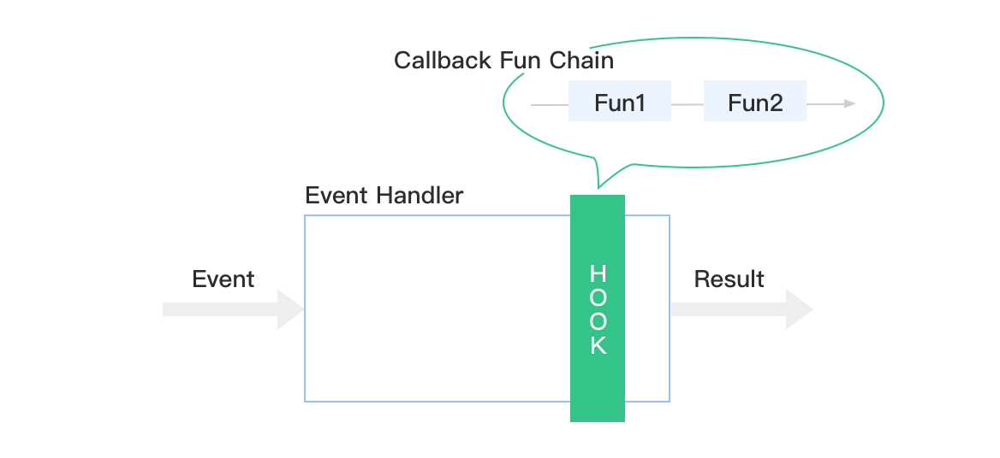

---
# 编写日期
date: 2020-02-18 17:15:26
# 作者 Github 名称
author: hjianbo
# 关键字
keywords:
# 描述
description:
# 分类
category: 
# 引用
ref:
---

# 钩子

## 定义

**钩子(Hooks)** 是 EMQ X 提供的一种机制，它通过拦截模块间的函数调用、消息传递、事件传递来修改或扩展系统功能。

简单来讲，该机制目的在于增强软件系统的扩展性、方便与其他三方系统的集成、或者改变其系统原有的默认行为。如：



当系统中不存在 **钩子 (Hooks)** 机制时，整个事件处理流程 *从 事件 (Event) 的输入，到 处理 (Handler)，再到完成后的返回 结果 (Result)* 对于系统外部而讲，都是不可见、且无法修改的。

而在这个过程中加入一个可挂载函数的点 (HookPoint)，允许外部插件挂载多个回调函数，形成一个调用链。达到对内部事件处理过程的扩展和修改。

系统中常用到的认证插件则是按照该逻辑进行实现的。以最简单的 [emqx_auth_mnesia](https://github.com/emqx/emqx/tree/master/apps/emqx_auth_mnesia) 为例：

在只开启 `emqx_auth_mnesia` 认证插件，且关闭匿名用户登录时。按照上图对事件的处理逻辑可知，此时认证模块的逻辑为：

1. 收到用户认证请求 (Authenticate)
2. 读取 *是否允许匿名登录* 参数，得到 **拒绝登录**
3. 执行 *认证事件的钩子*，即回调到 `emqx_auth_mnesia` 插件中，假设其认为此次登录合法，得到 **允许登录**
4. 返回 **认证成功**，成功接入系统

即，如下图所示：

```
                     EMQ X Core          Hooks & Plugins
                |<---  Scope  --->|<-------  Scope  -------->|
                |                 |                          |
  Authenticate  |     Allow       |   emqx_auth_mnesia       | Authenticate
 =============> > - - - - - - No -> - - - - - - - - - - -Yes->==============> Success
     Request    |    Anonymous?   |     authenticate?        |     Result
                |                 |                          |
                +-----------------+--------------------------+
```

因此，在 EMQ X 中，**钩子 (Hooks)** 这种机制极大地方便了系统的扩展。我们不需要修改 [emqx](https://github.com/emqx/emqx) 核心代码，仅需要在特定的位置埋下 **挂载点 (HookPoint)** ，便能允许外部插件扩展 EMQ X 的各种行为。

对于实现者来说仅需要关注：

1. **挂载点 (HookPoint)** 的位置：包括其作用、执行的时机、和如何挂载和取消挂载。
2. **回调函数** 的实现：包括回调函数的入参个数、作用、数据结构等，及返回值代表的含义。
3. 了解回调函数在 **链** 上执行的机制：包括回调函数执行的顺序，及如何提前终止链的执行。

如果你是在开发扩展插件中使用钩子，你应该能 **完全地明白这三点，且尽量不要在钩子内部使用阻塞函数，这会影响系统的吞吐**。


## 回调链

单个 **挂载点** 上可能会存在多个插件都需要关心该事件并执行相应操作，所以每个 **挂载点** 上都可能会存在多个回调函数。

我们称这种由多个回调函数顺序执行所构成的链为 **回调链 (Callback Functions Chain)**。

**回调链** 目前按照 [职责链(Chain-of-Responsibility)](https://en.wikipedia.org/wiki/Chain-of-responsibility_pattern) 的理念进行实现。为了满足钩子的功能和使用的灵活性，它必须具有以下属性：

- **回调链** 上的回调函数必须按某种先后顺序执行。
- **回调链** 一定会存在一个输入、和输出 (在通知类事件输出则是非必须的，例如 “某客户端已成功登陆”)。
- **回调链** 具有传递性，意思是指，链会将输入给链的入参输入给第一个回调函数，第一个回调函数的返回值会传递给第二个回调函数，直到最后一个函数，最后一个函数的返回值则为整个链的返回值。
- **回调链** 需要允许其上面的函数 *提前终止链* 和 *忽略本次操作*。
    
    - **提前终止**：本函数执行完成后，直接终止链的执行。忽略链上后续所有的回调函数。例如：某认证插件认为，此类客户端允许登录后便不需要再检查其他认证插件，所以需要提前终止。
    - **忽略本次操作**：不修改链上的处理结果，直接透传给下一个回调函数。例如：存在多个认证插件的情况下，某认证插件认为，此类客户端不属于其认证范围，所以我不需要修改认证结果，应当忽略本次操作，直接将前一个函数的返回值传递给链上的下一个函数。

由此，我们可以得到一个链的设计简图：


该图的含义是指：
1. 链的入参为只读的 `Args` 与用于链上的函数修改的参数 `Acc`
2. 链无论以何种方式终止执行，其返回值均为新的 `Acc` 
3. 图中链上一共注册了三个回调函数；分别为 `Fun1` `Fun2` `Fun3` 并按所表示的顺序执行
4. 回调函数执行顺序，由一个优先级确定，同一优先级的按挂载的先后顺序执行
5. 回调函数通过返回：
    - `ok`：忽略本次操作，以只读的 `Args` 和上个函数返回的 `Acc` 继续链的执行
    - `{ok, NewAcc}`：执行了某些操作，修改了 Acc 内容，以只读的 `Args` 和新的 `NewAcc` 继续链的执行
6. 回调函数也可通过返回：
    - `stop`：表示终止链的传递，立即返回上个函数的结果 `Acc`
    - `{stop, NewAcc}`：表示终止链的传递，立即返回本次修改的结果 `NewAcc`

以上为回调链的主要设计理念，它规范了钩子上的回调函数的执行逻辑。

接下来 [挂载点](#hookpoint)，[回调函数](#callback) 两节中，对于钩子的所有操作都是依赖于 [emqx](https://github.com/emqx/emqx) 提供的 Erlang 代码级的 API。他们是整个钩子逻辑实现的基础。如需寻求：



- 钩子和 HTTP 服务器的应用，参见： [WebHook](webhook.md)





- 钩子和 HTTP 服务器的应用，参见： [WebHook](webhook.md)
- 钩子与其他语言的应用，参见： [Multipe-Language-Support](lang.md)



## 挂载点

EMQ X 以一个客户端在其生命周期内的关键活动为基础，预置了大量的 **挂载点 (HookPoint)**。目前系统中预置的挂载点有：

| 名称                 | 说明         | 执行时机                                              |
| -------------------- | ------------ | ----------------------------------------------------- |
| client.connect       | 处理连接报文 | 服务端收到客户端的连接报文时                          |
| client.connack       | 下发连接应答 | 服务端准备下发连接应答报文时                          |
| client.connected     | 成功接入     | 客户端认证完成并成功接入系统后                        |
| client.disconnected  | 连接断开     | 客户端连接层在准备关闭时                              |
| client.authenticate  | 连接认证     | 执行完 `client.connect` 后                            |
| client.check_acl     | ACL 鉴权     | 执行 `发布/订阅` 操作前                               |
| client.subscribe     | 订阅主题     | 收到订阅报文后，执行 `client.check_acl` 鉴权前        |
| client.unsubscribe   | 取消订阅     | 收到取消订阅报文后                                    |
| session.created      | 会话创建     | `client.connected` 执行完成，且创建新的会话后         |
| session.subscribed   | 会话订阅主题 | 完成订阅操作后                                        |
| session.unsubscribed | 会话取消订阅 | 完成取消订阅操作后                                    |
| session.resumed      | 会话恢复     | `client.connected` 执行完成，且成功恢复旧的会话信息后 |
| session.discarded    | 会话被移除   | 会话由于被**移除**而终止后                            |
| session.takeovered   | 会话被接管   | 会话由于被**接管**而终止后                            |
| session.terminated   | 会话终止     | 会话由于其他原因被终止后                              |
| message.publish      | 消息发布     | 服务端在发布（路由）消息前                            |
| message.delivered    | 消息投递     | 消息准备投递到客户端前                                |
| message.acked        | 消息回执     | 服务端在收到客户端发回的消息 ACK 后                   |
| message.dropped      | 消息丢弃     | 发布出的消息被丢弃后                                  |


::: tip
- **会话被移除** 是指：当客户端以 `清除会话` 的方式登入时，如果服务端中已存在该客户端的会话，那么旧的会话就会被丢弃。

- **会话被接管** 是指：当客户端以 `保留会话` 的方式登入时，如果服务端中已存在该客户端的会话，那么旧的会话就会被新的连接所接管。
:::

### 挂载与取消挂载

EMQ X 提供了 API 进行钩子的挂载与取消挂载的操作。

**挂载**：

```erlang
%% Name: 钩子的名称（挂载点）如：'client.authenticate'
%% {Module, Function, Args}: 回调函数的模块、方法、和附加参数
%% Priority：优先级，整数; 不提供则默认为 0
emqx:hook(Name, {Module, Function, Args}, Priority).
```

挂载完成后，回调函数会按优先级从大到小执行，同一优先级按挂载的先后顺序执行。所有官方插件挂载的钩子优先级都为 `0`。

**取消挂载**：

```erlang
%% Name: 钩子的名称（挂载点）如：'client.authenticate'
%% {Module, Function}: 回调函数的模块、方法
emqx:unhook(Name, {Module, Function}).
```


## 回调函数

回调函数的入参及返回值要求，见下表：

(参数数据结构参见：[emqx_types.erl](https://github.com/emqx/emqx/blob/master/src/emqx_types.erl))


| 名称                 | 入参                                                         | 返回                |
| -------------------- | ------------------------------------------------------------ | ------------------- |
| client.connect       | `ConnInfo`：客户端连接层参数<br>`Props`：MQTT v5.0  连接报文的 Properties 属性 | 新的 `Props`        |
| client.connack       | `ConnInfo`：客户端连接层参数 <br>`Rc`：返回码<br>`Props`: MQTT v5.0  连接应答报文的 Properties 属性 | 新的 `Props`        |
| client.connected     | `ClientInfo`:  客户端信息参数<br>`ConnInfo`： 客户端连接层参数 | -                   |
| client.disconnected  | `ClientInfo`：客户端信息参数<br>`ConnInfo`：客户端连接层参数<br>`ReasonCode`：错误码 | -                   |
| client.authenticate  | `ClientInfo`：客户端信息参数<br>`AuthResult`：认证结果       | 新的 `AuthResult`   |
| client.check_acl     | `ClientInfo`：客户端信息参数<br>`Topic`：发布/订阅的主题<br>`PubSub`:  发布或订阅<br>`ACLResult`：鉴权结果 | 新的 `ACLResult`    |
| client.subscribe     | `ClientInfo`：客户端信息参数<br/>`Props`：MQTT v5.0 订阅报文的 Properties 参数<br>`TopicFilters`：需订阅的主题列表 | 新的 `TopicFilters` |
| client.unsubscribe   | `ClientInfo`：客户端信息参数<br/>`Props`：MQTT v5.0 取消订阅报文的 Properties 参数<br/>`TopicFilters`：需取消订阅的主题列表 | 新的 `TopicFilters` |
| session.created      | `ClientInfo`：客户端信息参数<br/>`SessInfo`：会话信息        | -                   |
| session.subscribed   | `ClientInfo`：客户端信息参数<br/>`Topic`：订阅的主题<br>`SubOpts`：订阅操作的配置选项 | -                   |
| session.unsubscribed | `ClientInfo`：客户端信息参数<br/>`Topic`：取消订阅的主题<br/>`SubOpts`：取消订阅操作的配置选项 | -                   |
| session.resumed      | `ClientInfo`：客户端信息参数<br/>`SessInfo`：会话信息        | -                   |
| session.discarded    | `ClientInfo`：客户端信息参数<br/>`SessInfo`：会话信息        | -                   |
| session.takeovered   | `ClientInfo`：客户端信息参数<br/>`SessInfo`：会话信息        |                     |
| session.terminated   | `ClientInfo`：客户端信息参数<br/>`Reason`：终止原因 <br>`SessInfo`：会话信息 | -   |
| message.publish      | `Message`：消息对象                                          | 新的 `Message`      |
| message.delivered    | `ClientInfo`：客户端信息参数<br/>`Message`：消息对象         | 新的 `Message`      |
| message.acked        | `ClientInfo`：客户端信息参数<br/>`Message`：消息对象         | -                   |
| message.dropped      | `Message`：消息对象<br>`By`：被谁丢弃<br>`Reason`：丢弃原因  | -                   |


具体对于这些钩子的应用，参见：[emqx_plugin_template](https://github.com/emqx/emqx-plugin-template)

