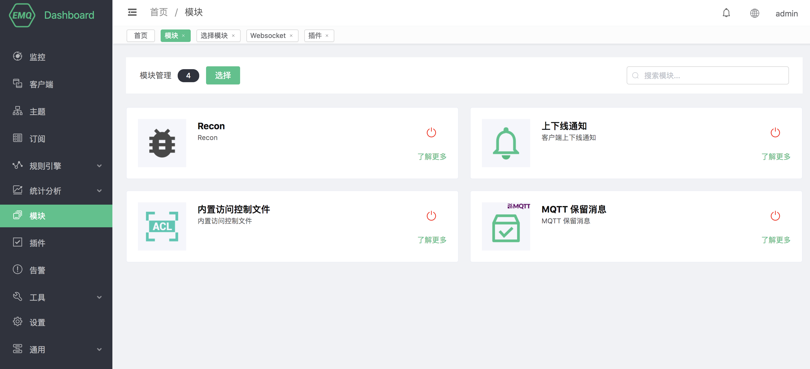
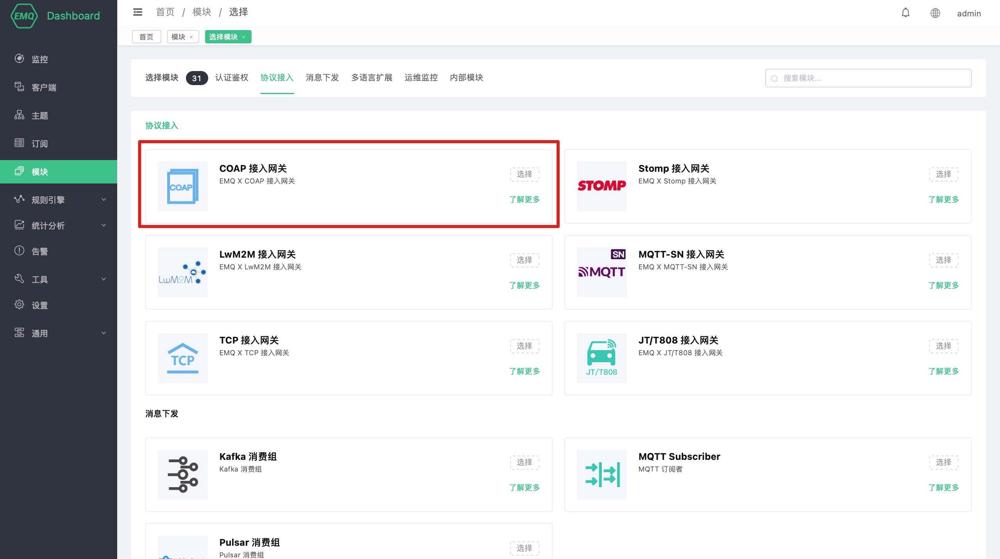
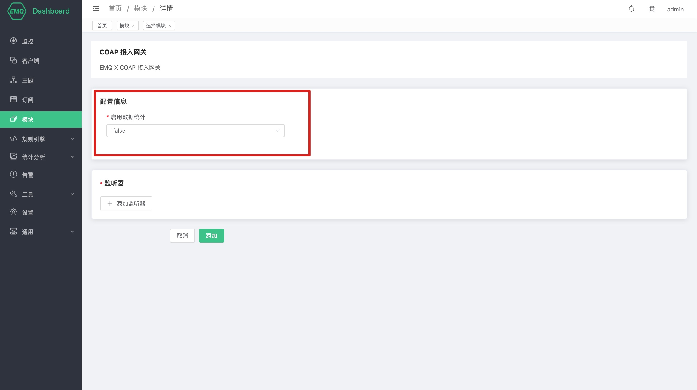
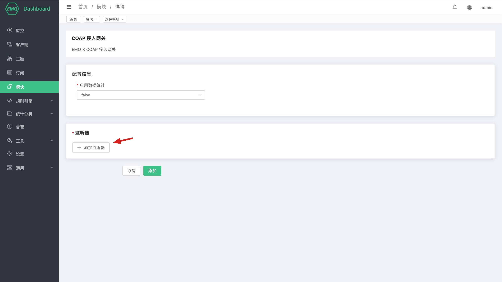
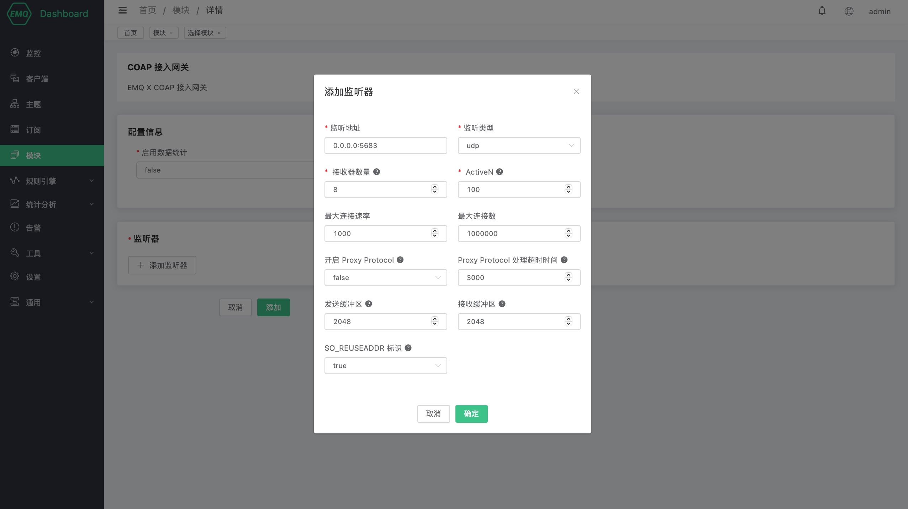
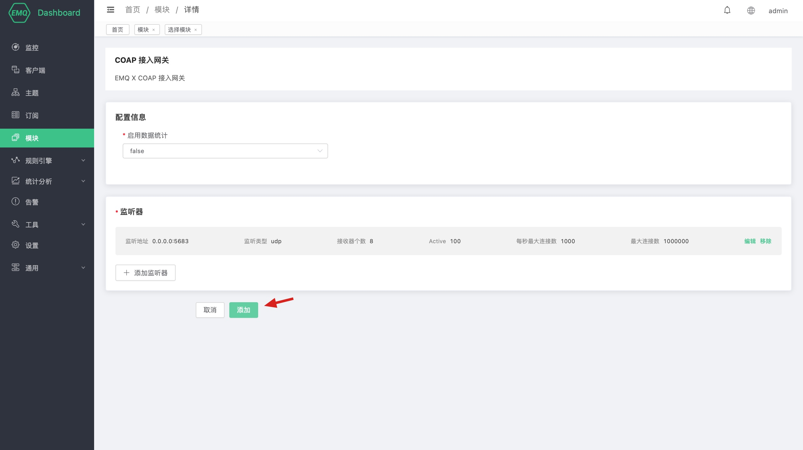

# CoAP 协议网关

CoAP 协议网关为 EMQ X 提供了 CoAP 协议的接入能力。它允许符合某种定义的 CoAP 消息格式向 EMQ X 执行发布，订阅，和接收消息等操作。

## 创建模块

打开 [EMQ X Dashboard](http://127.0.0.1:18083/#/modules)，点击左侧的 “模块” 选项卡，选择添加：



点击 “选择”，然后选择 “CoAP 接入网关”：



配置相关基础参数：



添加监听端口：



配置监听参数：



点击 “确定” 完成监听器的配置，然后点击 “添加” 完成模块的创建： 



## 使用示例

### 客户端

[libcoap](http://github.com/obgm/libcoap) 是一个非常易用的 CoAP 客户端库，此处我们使用它作为 CoAP 客户端来测试 EMQ X CoAP 接入网关的功能。

```
git clone http://github.com/obgm/libcoap
cd libcoap
./autogen.sh
./configure --enable-documentation=no --enable-tests=no
make
```

### PUBLISH 示例

使用 `libcoap` 发布一条消息：

```bash
libcoap/examples/coap-client -m put -e 1234  "coap://127.0.0.1/mqtt/topic1?c=client1&u=tom&p=secret"
```

- 主题名称为："topic1"  (不是 "/topic1")
- Client ID 为："client1"
- 用户名为："tom"
- 密码为："secret"
- Payload 为："1234"

### SUBSCRIBE 示例

使用 `libcoap` 订阅一个主题：

```
libcoap/examples/coap-client -m get -s 10 "coap://127.0.0.1/mqtt/topic1?c=client1&u=tom&p=secret"
```

- 主题名称为："topic1"  (不是 "/topic1")
- Client ID 为："client1"
- 用户名为："tom"
- 密码为："secret"
- 订阅的持续时间为：10 秒

在这个期间，如果 `topic1` 主题上有消息产生，`libcoap` 便会收到该条消息。

### 通信接口说明

#### CoAP Client Observe Operation

在 EMQ X CoAP 接入网关中，可以使用 CoAP 的 Observe 操作实现一个订阅主题的操作：

```
GET  coap://localhost/mqtt/{topicname}?c={clientid}&u={username}&p={password}    with OBSERVE=0
```

- 路径中的 "mqtt "为必填项
- 将 {topicname}、{clientid}、{username} 和 {password} 替换为你的真实值
- {topicname} 和 {clientid} 为必填项
- 如果 clientid 不存在，将返回 "bad_request"
- URI 中的 {topicname} 应该用 percent-encoded，以防止特殊字符，如 + 和 #
- {username} 和 {password} 是可选的
- 如果 {username} 和 {password} 不正确，将返回一个 uauthorized 错误
- 订阅的 QoS 等级恒定为 1


#### CoAP Client Unobserve Operation

使用 Unobserve 操作，取消订阅主题：

```
GET  coap://localhost/mqtt/{topicname}?c={clientid}&u={username}&p={password}    with OBSERVE=1
```

- 路径中的 "mqtt "为必填项
- 将 {topicname}、{clientid}、{username} 和 {password} 替换为你的真实值
- {topicname} 和 {clientid} 为必填项
- 如果 clientid 不存在，将返回 "bad_request"
- URI 中的 {topicname} 应该用 percent-encoded，以防止特殊字符，如 + 和 #
- {username} 和 {password} 是可选的
- 如果 {username} 和 {password} 不正确，将返回一个 uauthorized 错误

#### CoAP Client Notification Operation

接入网关会将订阅主题上收到到消息，以 `observe-notification` 的方式投递到 CoAP 客户端：


- 它的 payload 正是 MQTT 消息中的的 payload
- payload 数据类型为 "application/octet-stream"


#### CoAP Client Publish Operation

使用 CoAP 的 PUT 命令执行一次 PUBLISH 操作：

```
PUT  coap://localhost/mqtt/{topicname}?c={clientid}&u={username}&p={password}
```
- 路径中的 "mqtt "为必填项
- 将 {topicname}、{clientid}、{username} 和 {password} 替换为你的真实值
- {topicname} 和 {clientid} 为必填项
- 如果 clientid 不存在，将返回 "bad_request"
- URI 中的 {topicname} 应该用 percent-encoded，以防止特殊字符，如 + 和 #
- {username} 和 {password} 是可选的
- 如果 {username} 和 {password} 不正确，将返回一个 uauthorized 错误
- payload 可以是任何二进制数据
- payload 数据类型为 "application/octet-stream"
- 发布信息将以 qos0 发送


#### CoAP Client 保活

设备应定期发出 GET 命令，作为 ping 操作保持会话在线

```
GET  coap://localhost/mqtt/{any_topicname}?c={clientid}&u={username}&p={password}
```

- 路径中的 "mqtt "为必填项
- 将 {topicname}、{clientid}、{username} 和 {password} 替换为你的真实值
- {topicname} 和 {clientid} 为必填项
- 如果 clientid 不存在，将返回 "bad_request"
- URI 中的 {topicname} 应该用 percent-encoded，以防止特殊字符，如 + 和 #
- {username} 和 {password} 是可选的
- 如果 {username} 和 {password} 不正确，将返回一个 uauthorized 错误
- 客户端应该定期做 keepalive 工作，以保持会话在线，尤其是在 NAT 网络中的设备


### 备注

CoAP 接入网关不支持 `POST` 和 `DELETE` 方法。

在 URI 中的主题名称必须先经过 URI 编码处理(参考：RFC 7252 - section 6.4)

CoAP URI 中的 ClientId, Username, Password, Topic是 MQTT 中的概念。也就是说，CoAP 接入网关是通过借用 MQTT 中的名词概念，试图将 CoAP 信息融入到 MQTT 系统中。

EMQ X 的 认证，访问控制，钩子等功能也适用于 CoAP 接入网关。比如：

- 如果 用户名/密码 没有被授权, CoAP 客户端就会得到一个 `uauthorized` 的错误
- 如果 用户名/客户端ID 不允许发布特定的主题，CoAP 消息实际上会被丢弃，尽管 CoAP 客户端会从接入网关上得到一个 Acknoledgement
- 如果一个 CoAP 消息被发布，'message.publish' 钩子也能够捕获这个消息

### Well-known locations
--------------------

CoAP 接入网关的 well-known 发现恒定的返回 "</mqtt>,</ps>"

例如：
```
libcoap/examples/coap-client -m get "coap://127.0.0.1/.well-known/core"
```
