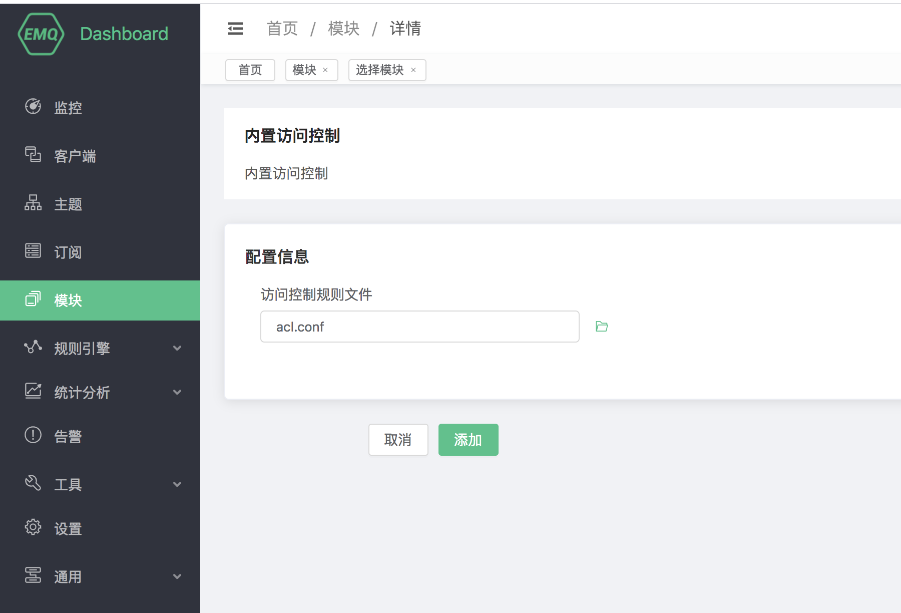

# ACL File 访问控制

内置 ACL 通过文件设置规则，使用上足够简单轻量，适用于规则数量可预测、无变动需求或变动较小的项目。

## 创建模块

内置访问控制模块默认启动，可以通过dashboard页面进行停止和更新。


配置相关参数



## 定义 ACL

内置 ACL 是优先级最低规则表，在所有的 ACL 检查完成后，如果仍然未命中则检查默认的 ACL 规则。

该规则文件以 Erlang 语法的格式进行描述：

```erlang
%% 允许 "dashboard" 用户 订阅 "$SYS/#" 主题

{allow, {user, "dashboard"}, subscribe, ["$SYS/#"]}.

%% 允许 IP 地址为 "127.0.0.1" 的用户 发布/订阅 "#SYS/#"，"#" 主题

{allow, {ipaddr, "127.0.0.1"}, pubsub, ["$SYS/#", "#"]}.

%% 拒绝 "所有用户" 订阅 "$SYS/#" "#" 主题

{deny, all, subscribe, ["$SYS/#", {eq, "#"}]}.

%% 允许其它任意的发布订阅操作

{allow, all}.
```

1. 第一条规则允许客户端发布订阅所有主题

2. 第二条规则禁止全部客户端订阅 `$SYS/#` 与 `#` 主题

3. 第三条规则允许 ip 地址为 `127.0.0.1` 的客户端发布/订阅 `$SYS/#` 与 `#` 主题，为第二条开了特例

4. 第四条规则允许用户名为 `dashboard` 的客户端订阅 `$SYS/#` 主题，为第二条开了特例

可知，默认的 ACL 主要是为了限制客户端对系统主题 `$SYS/#` 和全通配主题 `#` 的权限。

## acl.conf 编写规则

`acl.conf` 文件中的规则按书写顺序从上往下匹配。

`acl.conf` 的语法规则包含在顶部的注释中，熟悉 Erlang 语法的可直接阅读文件顶部的注释。或参考以下的释义：

- 以 `%%` 表示行注释。

- 每条规则由四元组组成，以 `.` 结束。

- 元组第一位：表示规则命中成功后，执行权限控制操作，可取值为：

​    * `allow`：表示 `允许`

​    * `deny`： 表示 `拒绝`

- 元组第二位：表示规则所生效的用户，可使用的格式为：

​    * `{user, "dashboard"}`：表明规则仅对 *用户名 (Username)* 为 "dashboard" 的用户生效

​    * `{clientid, "dashboard"}`：表明规则仅对 *客户端标识 (ClientId)* 为 "dashboard" 的用户生效

​    * `{ipaddr, "127.0.0.1"}`：表明规则仅对 *源地址* 为 "127.0.0.1" 的用户生效

​    * `all`：表明规则对所有的用户都生效

- 元组第三位：表示规则所控制的操作，可取值为：

​    * `publish`：表明规则应用在 PUBLISH 操作上

​    * `subscribe`：表明规则应用在 SUBSCRIBE 操作上

​    * `pubsub`：表明规则对 PUBLISH 和 SUBSCRIBE 操作都有效

- 元组第四位：表示规则所限制的主题列表，内容以数组的格式给出，例如：

​    * `"$SYS/#"`：为一个 **主题过滤器 (Topic Filter)**；表示规则可命中与 `$SYS/#` 匹配的主题；如：可命中 "$SYS/#"，也可命中 "$SYS/a/b/c"

​    * `{eq, "#"}`：表示字符的全等，规则仅可命中主题为 `#` 的字串，不能命中 `/a/b/c` 等

- 除此之外还存在两条特殊的规则：

- `{allow, all}`：允许所有操作

- `{deny, all}`：拒绝所有操作



acl.conf 中应只包含一些简单而通用的规则，使其成为系统基础的 ACL 原则。如果需要支持复杂、大量的 ACL 内容可以选择外部资源去实现它。




